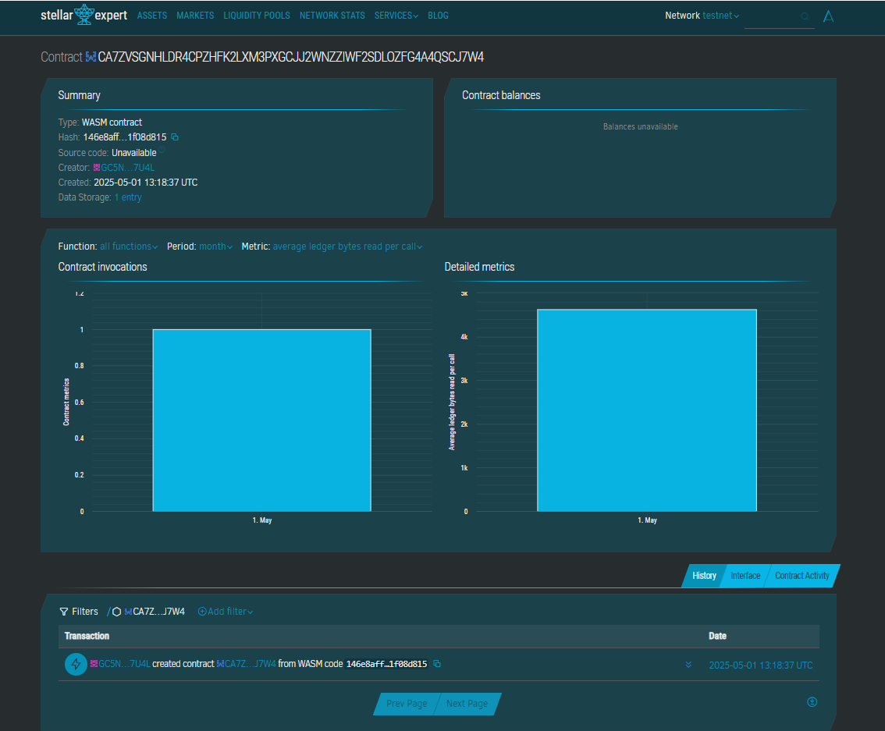

# Digital Art NFT Collection

## Project Description
The Digital Art NFT Collection is a Soroban smart contract designed to help artists mint, store, and manage digital artworks as NFTs on a decentralized platform. It provides basic functionality to mint new tokens, list them for sale, and manage their availability.

## Project Vision
To empower digital artists by providing a secure and decentralized platform for showcasing, listing, and preserving ownership of their digital creations on the blockchain.

## Key Features
- **Mint NFT**: Artists can mint a new NFT with a title and their name.
- **List NFT**: Mark NFTs as listed for visibility or sale.
- **Unlist NFT**: Hide NFTs from the public listing.
- **Fetch NFT Details**: View full metadata of an individual NFT using its ID.

## Future Scope
- NFT trading and auction mechanism.
- Royalties support for artists on resales.
- Integration with IPFS for decentralized image storage.
- Ownership transfer and marketplace integration.
Contract ID:- CA7ZVSGNHLDR4CPZHFK2LXM3PXGCJJ2WNZZIWF2SD

